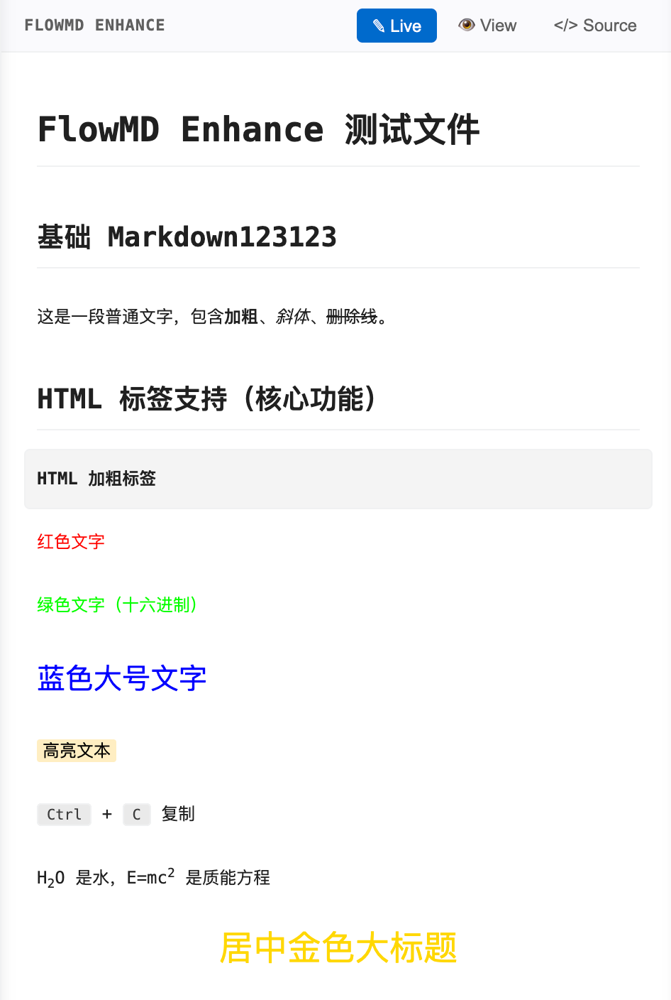

# FlowMD Enhance

[中文文档](README_ZH.md)

A WYSIWYG Markdown editor for VS Code with full HTML tag support, block-level editing, and integrated page search.



## Features

### Three Editing Modes

| Mode | Description |
|------|-------------|
| **Live Preview** | Block-level editing — click a block to edit raw Markdown, blur to render |
| **Viewer** | Read-only rendered preview |
| **Source** | Raw Markdown text editing |

### Full HTML Tag Support

Unlike VS Code's built-in Markdown preview, FlowMD Enhance renders inline HTML tags directly:

```html
<font color="red">Colored text</font>
<span style="color: blue; font-size: 20px;">Styled text</span>
<mark>Highlighted</mark>
<kbd>Ctrl</kbd> + <kbd>C</kbd>
<details><summary>Collapsible</summary>Content here</details>
<ruby>汉<rt>hàn</rt></ruby>
```

Supports: `<font>`, `<span>`, `<mark>`, `<kbd>`, `<details>`, `<summary>`, `<sub>`, `<sup>`, `<ruby>`, `<rt>`, `<b>`, `<i>`, `<u>`, `<s>`, `<table>` with `colspan`/`rowspan`, and inline `style` attributes.

### Page Search

- **Cmd/Ctrl + F** — Open search bar
- **Enter / Shift+Enter** — Next / previous match
- **Aa** button — Toggle case sensitivity
- **Escape** — Close search
- Highlights work across all three modes (including Source mode via backdrop overlay)

### Undo / Redo

- **Cmd/Ctrl + Z** — Undo
- **Cmd/Ctrl + Shift + Z** — Redo
- 50-step history stack, persists across mode switches

### Task Lists

Interactive checkboxes rendered from `- [ ]` / `- [x]` syntax.

### Code Blocks

Fenced code blocks with syntax header and one-click copy button.

### External File Sync

Detects external file changes (e.g. git pull) and reloads content automatically, with self-save filtering to prevent feedback loops.

## Settings

| Setting | Default | Description |
|---------|---------|-------------|
| `flowMdEnhance.defaultMode` | `live` | Default editing mode: `live`, `viewer`, or `source` |

## Requirements

- VS Code 1.85.0+

## License

MIT
